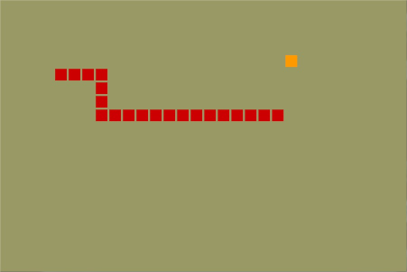

# snakee

A Snake Game clone built with C and SDL



## How to run the game

### Windows

Just use MinGW Make to run the Makefile. It'll create a .exe file in 
the *executable* subdirectory. Type in the terminal as follows:
```
mingw32-make
```

Then, run the executable :)

**Notes:**
  - I used SDL 2.0 64-bit libraries. If you are using a 32-bit compiler 
or OS and something fails, then try to use the 32-bit 
[libraries](https://www.libsdl.org/download-2.0.php).
  - If you use a IDE, then you need to setup it properly. Try 
[this](http://www.grhmedia.com/SDL001.php) (the process is similar for 
any IDE).

### Other OS

If your OS isn't Windows, then you need to install the appropriate SDL 
libraries and to change the Makefile accordingly. See 
[this](https://wiki.libsdl.org/Installation).


## Contributing

Feel free to modify and improve this project. Pull requests are welcome 
:)
